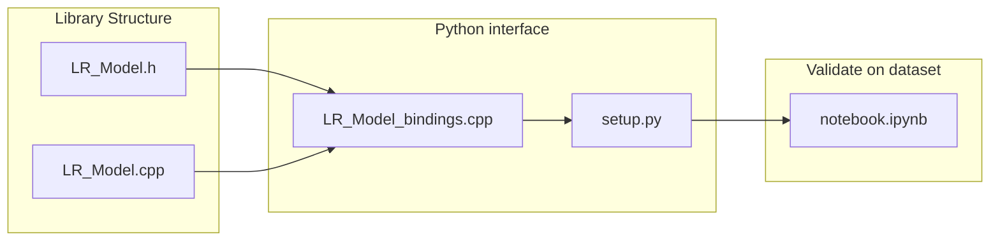
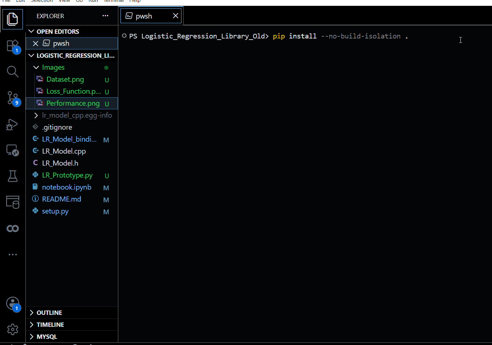
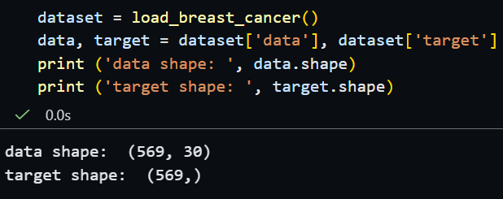
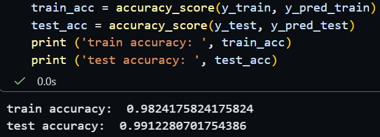

# Logistic Regression From Scratch 
## Overview 
The project's goal is to build a Machine Learning Library from scratch in C++, using the algorithm Logistic Regression. This Machine Learning model is able to do binary classification tasks, basically mean answering a Yes - No question (e.g. a person is sick or not). 

## Files
```text
Logisitc Regression Library
|
|--Main files:
|
|  |--LR_Model.h         - Initialize methods & coefficients
|  |--LR_Model.cpp       - Implement functions & methods
|  |--LR_Model_bindings  - Exposes C++ library module to Python
|  |--setup.py           - Install the library module for Python
|
|--Prototype library structure:
|
|  |--Loss_Function.png  - The loss function of Logistic Regression
|  |--LR_Prototype.py    - Prototype the library in Python with supported function
|
|--Validate the library: 
|
|  |--notebook.ipynb     - Validate the library with breast cancer datset
```

## Library Structure 


## Create library module 
* Download the required tools from [Microsoft C++ Build Tools](https://visualstudio.microsoft.com/visual-cpp-build-tools/) 
* Use command "**pip install --no-build-isolation .**"": to create the modules 
#
<p align = 'center'>
    
</p>

## Performance 
The library achieves reasonable performance on `breast cancer` dataset: 
<p align = 'center'>
    
    
</p>